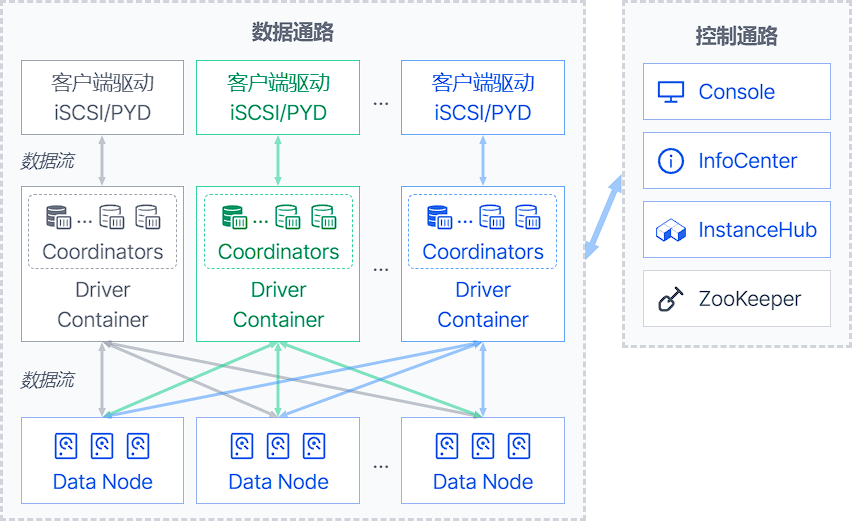
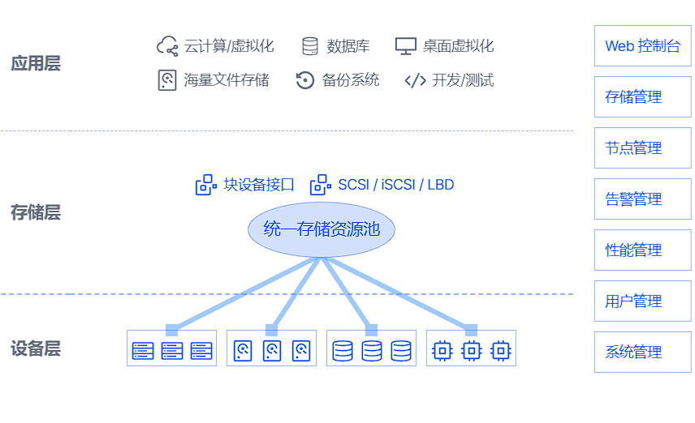

# ZettaStor DBS

[](LICENSE.md)


[English](README.md) | 简体中文 | [ZettaStor DBS 网站](https://zdbs.io)

目录
========

- [ZettaStor DBS 简介](#zettastor-dbs-分布式块存储系统)
  - [系统架构图](#系统架构图)
  - [系统示意图](#系统示意图)
- [技术优势](#技术优势)
- [不同版本的功能比较](#不同版本的功能比较)
- 用户文档
  - [安装操作系统](docs/operatingsystem-zh.md)
  - [快速配置与部署](INSTALL-zh.md)
  - [高级配置与定制](docs/configuration-zh.md)
  - [用户手册](docs/manual-zh.md)
- 开发文档
  - [编译说明](#快速上手)
  - [开发指南](docs/devguide-zh.md)
  - [编码标准](#编码标准)
  - [提交代码](#提交代码)
  - [许可证](LICENSE.md)

# ZettaStor DBS 分布式块存储系统

ZettaStor DBS 由 [南京鹏云网络科技有限公司](https://www.pengyunnetwork.cn)（简称“鹏云网络”）完全自主研发。该产品可为大规模虚拟化、私有云和容器环境，提供高可用、高性能、易扩展、易维护的企业级用户业务存储解决方案，成为核心应用上云的坚实数据底座。

ZettaStor DBS 分为社区版（开源）和商业版。社区版的源代码在 [AGPL 3.0](LICENSE.md) 许可证下进行分发。

## 系统架构图


## 系统示意图


# 技术优势

ZettaStor DBS（分布式块存储系统）是鹏云网络研发的第一款产品，于2015年正式发布v1.0，主要应用于企业的云计算环境。

DBS 的第一个商用版本是按照电信运营商的规范要求来完善的，通过了三大运营的测试，达到电信级设备的要求。近几年 DBS 针对金融行业进行了打磨，按照金融行业要求进一步加强了稳定性和可靠性，已在金融行业关键业务场景稳定运行近2年。

如今，DBS 完成了从“电信级”到“金融级”的跃升，是一款高起点、高要求的分布式存储产品，能够满足市场不断变化的新需求。

- [x] __去中心化架构__：采用全对称分布式架构设计及基于类区块链的去中心化设计，消除了中心节点对系统规模、I/O 性能、稳定性和可靠性等方面的种种限制和不利因素。
- [x] __大规模节点部署__：在保持系统稳定性及高性能的前提下，支持上万节点规模部署，容量和存储性能随存储节点增加线性增长，从而获得海量规模的支撑能力。
- [x] __亚毫秒级延迟__：优化网络数据路径，在处理数据读写时直接操作硬盘本身，从而缩短 I/O 处理路径，在磁盘介质做主存的配置情况下，可实现毫秒以内的 I/O 延迟。
- [x] __无感知故障恢复__：在硬盘或节点故障时，能立即由健康硬盘或节点接管任务，避免发生 I/O 性能急剧下降或中断的情况，故障恢复时间小于 1 秒，业务无感知。
- [x] __自主可控，安全可靠__：拥有完整知识产权，自主研发，兼容主流国产化硬件和操作系统，提供全国产化存储解决方案。

# 不同版本的功能比较

下表比较了不同版本 ZettaStor DBS 之间的一些关键功能：

| 功能 | 社区版 | 商业版 | 
| ------------- | ------------- |  ------------- | 
| 扩展卷 | |  |
| 精简卷 |  |  |
| 克隆卷 |  |  |
| 快照卷 |  |  |
| iSCSI 协议 | |  |
| PYD 协议 | |  |
| 访问控制 | |  |
| 数据访问策略 | |  |
| 数据重构策略 | |  |
| 负载均衡策略 | |  |
| 缓存加速 |  |  |
| 全系统掉电保护 |  |  |
| 磁盘点灯 |  |  |
| 磁盘漫游 | |  |
| 告警管理 |  |  |
| 用户管理 | |  |
| 日志审计 | |  |
| 图形化操作 | |  |

# 快速上手

在 Linux 系统下，可以通过键入下列命令安装编译所需要的软件包：

## 1、准备编译环境

### RHEL/CentOS 7
```bash
yum install epel-release
yum -y install git java-1.8.0-openjdk-devel thrift curl unzip

# 安装新版 Apache Maven
curl -LO https://downloads.apache.org/maven/maven-3/3.5.4/binaries/apache-maven-3.5.4-bin.tar.gz
tar -zxvf apache-maven-3.5.4-bin.tar.gz --directory /opt
ln -s /opt/apache-maven-3.5.4 /opt/maven
chown -R root:root /opt/maven
echo '# Apache Maven 环境变量' > /etc/profile.d/maven.sh
echo 'export JAVA_HOME=/usr/lib/jvm/java-1.8.0-openjdk/' >> /etc/profile.d/maven.sh
echo 'export PATH=/opt/maven/bin:${PATH}' >> /etc/profile.d/maven.sh

# 安装新版 Protocol Buffers
curl -LO https://github.com/protocolbuffers/protobuf/releases/download/v3.5.1/protoc-3.5.1-linux-x86_64.zip
unzip protoc-3.5.1-linux-x86_64.zip -d /usr/local
```

### RHEL/CentOS 8
```bash
yum install epel-release
yum install git net-tools maven compat-openssl10 protobuf-compiler
yum install https://dl.fedoraproject.org/pub/epel/7/x86_64/Packages/t/thrift-0.9.1-15.el7.x86_64.rpm
```

### RHEL 9
```bash
yum install git maven unzip
yum install http://mirror.centos.org/centos/8-stream/AppStream/x86_64/os/Packages/compat-openssl10-1.0.2o-3.el8.x86_64.rpm
yum install https://dl.fedoraproject.org/pub/epel/7/x86_64/Packages/t/thrift-0.9.1-15.el7.x86_64.rpm
curl -LO https://github.com/protocolbuffers/protobuf/releases/download/v3.5.1/protoc-3.5.1-linux-x86_64.zip
unzip protoc-3.5.1-linux-x86_64.zip -d /usr/local
```

### Debian 10/11, Ubuntu 18/20
```bash
sudo apt-get update
sudo apt-get install git net-tools curl openjdk-11-jdk maven protobuf-compiler
curl -LO http://ftp.debian.org/debian/pool/main/t/thrift-compiler/thrift-compiler_0.9.1-2.1+b1_amd64.deb
sudo dpkg -i thrift-compiler_0.9.1-2.1+b1_amd64.deb
```

### SUSE/SLES 15
```bash
zypper install net-tools-deprecated curl unzip maven thrift
curl -LO https://github.com/protocolbuffers/protobuf/releases/download/v3.5.1/protoc-3.5.1-linux-x86_64.zip
unzip protoc-3.5.1-linux-x86_64.zip -d /usr/local
```

### 其他架构和平台
要编译 ZettaStor DBS，您需要：
- Java Development Kit (JDK) 11
- Apache Maven 3.5
- Apache Thrift 0.9.1
- Protocol Buffers 3.5.1

一般来说，最便捷的方法是下载预编译的二进制文件。如果要从源代码编译二进制文件，请参阅下列章节。

#### Apache Thrift
要从源代码编译 Thrift，请查看 [安装说明](https://thrift.apache.org/docs/install/)。请注意各个操作系统可能有相关的特定要求。

#### Protocol Buffers (Protobuf)
首先检查您是否可以下载 [protobuf 3.5.1 预编译二进制文件](https://github.com/protocolbuffers/protobuf/releases/tag/v3.5.1)。如果要从源代码编译 protoc 二进制文件，请查看 [安装说明](https://github.com/protocolbuffers/protobuf/blob/main/src/README.md)。

## 2、开始编译
在`pengyun-root/pom.xml`所在目录，使用下列 Maven 命令编译软件包：
```bash
# 根据系统环境更新版本号
mvn versions:set-property -Dproperty=libthrift.version -DnewVersion=$(thrift --version | awk '{print $3}')
mvn versions:set-property -Dproperty=protobuf.version -DnewVersion=$(protoc --version | awk '{print $2}')
mvn clean install -Dcheckstyle.skip=true -DskipTests
```

# 更多文档
请参阅 [ZettaStor DBS 官方网站](https://zdbs.io)

# 贡献代码

## 编码标准
请在编辑器中设置2空格缩进后，查看和编辑本项目的源代码，每个缩进级别使用一次缩进。空格可用于一行内的其他对齐方式。

大部分代码遵循 [Google Java 风格](https://google.github.io/styleguide/javaguide)；也有一些代码遵循 [Oracle 编码约定](https://www.oracle.com/java/technologies/javase/codeconventions-contents.html) —— 这主要取决于最初的版本。 重要的是，**您修改代码的时候请保持一致，并在修改现有源代码时将空格更改保持在最低限度。** 对于新代码，请使用 Google Java 风格。

## 提交代码
完成代码开发后，您应该向 master 分支提交拉取请求 (PR) 并填写拉取请求模板。拉取请求会自动触发持续整合 (CI) 流程，代码只有在通过 CI 并审核后才会被合并。 如果 CI 运行失败，您可以登录 Jenkins 平台查看失败原因。

我们在工程编译过程中引入了代码风格检查流程，请在提交代码之前检查编译结果，确保没有代码风格错误。虽然在审核您的 PR 之前必须满足上述先决条件，但审核者可能会要求您完成额外的设计工作、测试、或其他更改，然后才能最终接受 PR。

# 许可证
[AGPL 3.0](LICENSE.md)
