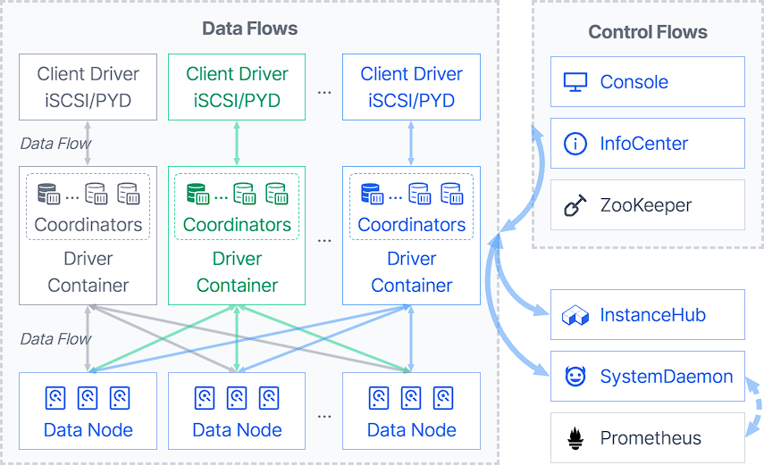
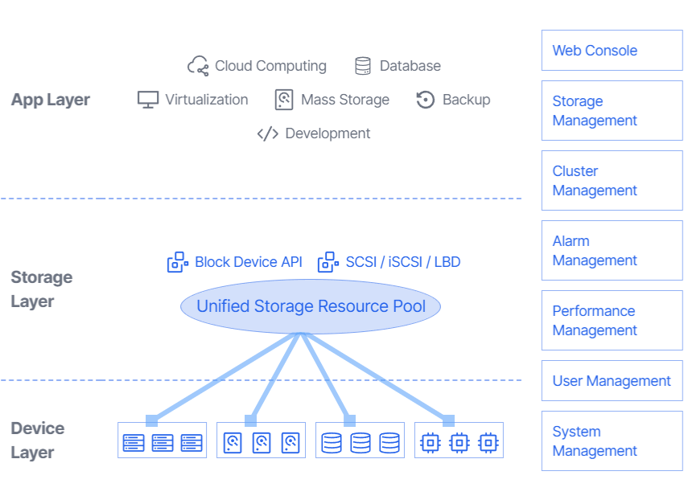

# ZettaStor DBS

[](LICENSE.md)


English | [简体中文](README-zh.md) | [ZettaStor DBS Website](https://zdbs.io)

Content Index
========

- [About ZettaStor DBS](#what-is-zettastor-dbs)
  - [System Architecture Diagram](#system-architecture-diagram)
  - [Schematic Diagram](#schematic-diagram)
- [Technical Advantages](#technical-advantages)
- [Versions and Features](#versions-and-features)
- User Documentation
  - [Operating System Installation](docs/operatingsystem.md)
  - [Getting Started](INSTALL.md)
  - Advanced Configuration
  - User Manual
- Developer Documentation
  - [How to Compile](#quick-start)
  - [Coding Standard](#coding-standard)
  - [Submit Your Code](#submit-your-code)
  - [License](LICENSE.md)

# What is ZettaStor DBS？

ZettaStor DBS provides enterprise-level business storage solutions with high availability, high performance, easy expansion and easy maintenance for large-scale virtualization, private cloud and container environments. ZettaStor DBS, the solid digital base for cloud-based core applications, is independently developed by [Pengyun Network](https://www.pengyunnetwork.cn).

ZettaStor DBS comes in two distributions: the Community Edition and Enterprise Edition. The source code for the Community Edition is distributed under the [AGPL 3.0](LICENSE.md) license.

## System Architecture Diagram


## Schematic Diagram


# Technical Advantages

ZettaStor DBS is independently developed by Pengyun Network, since its initial release of version 1.0 in 2015, the product has been widely used in private clouds and data centers in various industries, such as telecommunications, finance, government, military, public security, media, medical care, education, scientific research, etc., and can seamlessly adapt to typical applications without any changes.

- [x] __Decentralized Architecture__: A symmetric distributed architecture based on the decentralized blockchain network, eliminates traditional limitations and disadvantages on system scale, I/O performance, stability and reliability.
- [x] __Large-scale Node Deployment__: Stable high-performance is constantly maintained at optimal conditions, with the deployment of tens of thousands of nodes. The product's capacity and performance scale linearly with more storage nodes.
- [x] __Sub-millisecond Latency__: Minimized I/O processing path by directly reading/writing to disk, using an optimized network data path. It is capable of achieving sub-millisecond latencies with magnetic storage devices as primary storage configuration.
- [x] __Recovery-in-place__: When a hard disk or node failure occurs, a healthy one can immediately take over. The fault recovery time is less than 1 second, and there will be no impact on I/O performance.
- [x] __Secure and Controllable__: Complete intellectual property ownership with independent research-and-development, compatible with China-made hardware, operating systems and localized storage solutions.

# Versions and Features

The following table compares some key features between various versions of ZettaStor DBS.

| Features | Community Edition  | Enterprise Edition | 
| ------------- | ------------- |  ------------- | 
| Volume Extension | |  |
| Volume Shrink |  |  |
| Volume Clone |  |  |
| Volume Snapshot |  |  |
| iSCSI Protocol | |  |
| PYD Protocol | |  |
| Access Control | |  |
| Data Access Control Strategy | |  |
| Data Reconstruction Strategy | |  |
| Load Balancing Strategy | |  |
| Cache Boosting |  |  |
| System-wide Power Failure Protection |  |  |
| Disk Indicator |  |  |
| Disk Roaming | |  |
| Alarm Management |  |  |
| User Management | |  |
| Log Auditor | |  |
| GUI Operation | |  |

# Quick Start

If you're on Linux, the packages required for compilation can be installed by the folowing commands

## 1. Setup a development environment

### CentOS 7 / RHEL 7
```bash
yum install https://dl.fedoraproject.org/pub/epel/epel-release-latest-7.noarch.rpm
yum install net-tools maven thrift protobuf-compiler
```

### CentOS 8 / RHEL 8
```bash
yum install https://dl.fedoraproject.org/pub/epel/epel-release-latest-8.noarch.rpm
yum install net-tools maven compat-openssl10 protobuf-compiler
yum install https://dl.fedoraproject.org/pub/epel/7/x86_64/Packages/t/thrift-0.9.1-15.el7.x86_64.rpm
```

### Debian 10 / Debian 11 / Ubuntu 18 / Ubuntu 20
```bash
sudo apt-get install net-tools curl maven protobuf-compiler
curl -LO http://ftp.debian.org/debian/pool/main/t/thrift-compiler/thrift-compiler_0.9.1-2.1+b1_amd64.deb
sudo dpkg -i thrift-compiler_0.9.1-2.1+b1_amd64.deb
```

### openSUSE 15
```bash
zypper install net-tools-deprecated curl unzip maven thrift
curl -LO https://github.com/protocolbuffers/protobuf/releases/download/v3.5.1/protoc-3.5.1-linux-x86_64.zip
unzip protoc-3.5.1-linux-x86_64.zip -d /usr/local
```

## 2. Compiling the code
To build the package, Use the following commands in the directory where pom.xml is located
```bash
mvn versions:use-dep-version -DdepVersion=$(thrift --version | awk '{print $3}') -Dincludes=org.apache.thrift:libthrift
mvn versions:use-dep-version -DdepVersion=$(protoc --version | awk '{print $2}') -Dincludes=com.google.protobuf:protobuf-java
mvn clean install
```

# Where can I find out more?
[ZettaStor DBS Website](https://zdbs.io)

# Contributing

## Coding standard
Source code should be viewed and edited with your editor set to use two spaces per tab, with one tab used per indentation level. Spaces are used for other alignment within a line.

Most parts of the code follow [Google Java Style](https://google.github.io/styleguide/javaguide.html); some parts of the code follow [Oracle's Code Conventions](https://www.oracle.com/java/technologies/javase/codeconventions-contents.html) -- mostly depending on who wrote the original version. Above all else, **be consistent with what you modify, and keep whitespace changes to a minimum when modifying existing source.** For new code, use Google Java Style.

## Submit your code
After finishing the development of your code, you should submit a pull request to master branch and fill out a pull request template. The pull request will trigger the CI automatically, and the code will only be merged after passing the CI and being reviewed. The Jenkins username and password of CI is netease/netease. If the CI fails to run, you can login to the Jenkins platform to view the reason for the failure. 

An automated code style check has been added in the project compilation process. Please check the compilation result before submitting the code to ensure that there are no code style errors. While the prerequisites above must be satisfied prior to having your pull request reviewed, the reviewer may ask you to complete additional design work, tests, or other changes before your pull request can be ultimately accepted.

# License
[AGPL 3.0](LICENSE.md)
