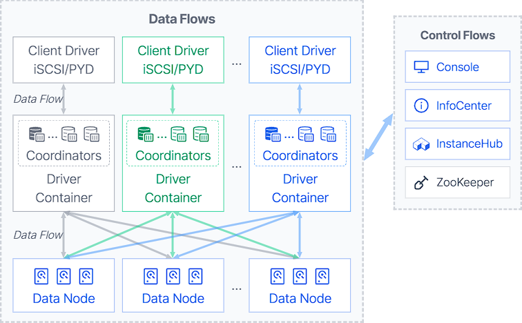

# ZettaStor DBS

[](LICENSE.md)


English | [简体中文](README-zh.md) | [ZettaStor DBS Website](https://zdbs.io)

Content Index
========

- [About ZettaStor DBS](#what-is-zettastor-dbs)
  - [System Architecture Diagram](#system-architecture-diagram)
  - [Schematic Diagram](#schematic-diagram)
- [Technical Advantages](#technical-advantages)
- [Versions and Features](#versions-and-features)
- User Documentation
  - [Operating System Installation](docs/operatingsystem.md)
  - [Getting Started](INSTALL.md)
  - [Advanced Configuration](docs/configuration.md)
  - User Manual
- Developer Documentation
  - [How to Compile](#quick-start)
  - [Developer's Guide](docs/devguide.md)
  - [Coding Standard](#coding-standard)
  - [Submit Your Code](#submit-your-code)
  - [License](LICENSE.md)

# What is ZettaStor DBS？

[ZettaStor DBS](https://zdbs.io) provides enterprise-level business storage solutions with high availability, high performance, easy expansion and easy maintenance for large-scale virtualization, private cloud and container environments. ZettaStor DBS, the solid digital base for cloud-based core applications, is independently developed by [Pengyun Network](https://www.pengyunnetwork.cn).

[ZettaStor DBS](https://zdbs.io) comes in two distributions: the Community Edition and Enterprise Edition. The source code for the Community Edition is distributed under the [AGPL 3.0](LICENSE.md) license.

## System Architecture Diagram


## Schematic Diagram


# Technical Advantages

[ZettaStor DBS](https://zdbs.io) is the first product developed by Pengyun Network. Version 1.0 was officially released in 2015 and mainly adopted by cloud computing companies.

The first commercial version of DBS is developed according to the standard requirements of telecom operators, and has passed the tests of China's three major telecom operators for telecom equipment applications. In recent years, DBS has been polished for the financial industry, its stability and reliability has been further strengthened and has been operating stably in key business scenarios for 4 years.

[ZettaStor DBS](https://zdbs.io) has completed the leap from telecom-grade to financial-grade. It is a distributed storage product with a high starting point and high requirements, which can meet the new and changing needs of the market.

- [x] __Decentralized Architecture__: A symmetric distributed architecture based on the decentralized blockchain network, eliminates traditional limitations and disadvantages on system scale, I/O performance, stability and reliability.
- [x] __Large-scale Node Deployment__: Stable high-performance is constantly maintained at optimal conditions, with the deployment of tens of thousands of nodes. The product's capacity and performance scale linearly with more storage nodes.
- [x] __Sub-millisecond Latency__: Minimized I/O processing path by directly reading/writing to disk, using an optimized network data path. It is capable of achieving sub-millisecond latencies with magnetic storage devices as primary storage configuration.
- [x] __Recovery-in-place__: When a hard disk or node failure occurs, a healthy one can immediately take over. The fault recovery time is less than 1 second, and there will be no impact on I/O performance.
- [x] __Secure and Controllable__: Complete intellectual property ownership with independent research-and-development, compatible with China-made hardware, operating systems and localized storage solutions.

# Versions and Features

The following table compares some key features between various versions of [ZettaStor DBS](https://zdbs.io).

| Features | Community Edition  | Enterprise Edition | 
| ------------- | ------------- |  ------------- | 
| Volume Extension | |  |
| Volume Shrink |  |  |
| Volume Clone |  |  |
| Volume Snapshot |  |  |
| iSCSI Protocol | |  |
| PYD Protocol | |  |
| Access Control | |  |
| Data Access Control Strategy | |  |
| Data Reconstruction Strategy | |  |
| Load Balancing Strategy | |  |
| Cache Boosting |  |  |
| System-wide Power Failure Protection |  |  |
| Disk Indicator |  |  |
| Disk Roaming | |  |
| Alarm Management |  |  |
| User Management | |  |
| Log Auditor | |  |
| GUI Operation | |  |

# Quick Start

## I. Downloading the Source
The repositories of ZettaStor DBS must be organized in a hierarchy structure.
<details>
  <summary>Click here for details on source code structure</summary>
<table>
<tr>
  <td rowspan="30">pengyun-root</td>
  <td rowspan="8">pengyun-lib</td>
  <td id="database_core">pengyun-database_core</td>
</tr>
<tr>
  <td>pengyun-core</td>
</tr>
<tr>
  <td>pengyun-models</td>
</tr>
<tr>
  <td>pengyun-dih_model</td>
</tr>
<tr>
  <td>pengyun-dih_client</td>
</tr>
<tr>
  <td>pengyun-query_log</td>
</tr>
<tr>
  <td>pengyun-configuration_common</td>
</tr>
<tr>
  <td>pengyun-monitor_common</td>
</tr>
<tr>
  <td rowspan="14">pengyun-dbs</td>
  <td>pengyun-database_core</td>
</tr>
<tr>
  <td>dbs-dnmodel</td>
</tr>
<tr>
  <td>dbs-models_related</td>
</tr>
<tr>
  <td>pengyun-driver_core</td>
</tr>
<tr>
  <td>pengyun-coordinator</td>
</tr>
<tr>
  <td>pengyun-infocenter</td>
</tr>
<tr>
  <td>pengyun-drivercontainer</td>
</tr>
<tr>
  <td>pengyun-deployment_daemon</td>
</tr>
<tr>
  <td>pengyun-datanode_core</td>
</tr>
<tr>
  <td>pengyun-datanode_service</td>
</tr>
<tr>
  <td>pengyun-datanode</td>
</tr>
<tr>
  <td>pengyun-webservice_adapter</td>
</tr>
<tr>
  <td>pengyun-utils</td>
</tr>
<tr>
  <td>pengyun-console</td>
</tr>
</table>
</details>
Please use the following commands to download the source code:
```bash
export ROOT_PATH=git@github.com

git clone -b 1.0-OS $ROOT_PATH:zettastor/pengyun-root
pushd pengyun-root

git clone -b 1.0-OS $ROOT_PATH:zettastor/pengyun-lib
pushd pengyun-lib
git clone -b 1.0-OS $ROOT_PATH:zettastor/pengyun-core
git clone -b 1.0-OS $ROOT_PATH:zettastor/pengyun-database_core
git clone -b 1.0-OS $ROOT_PATH:zettastor/pengyun-models
git clone -b 1.0-OS $ROOT_PATH:zettastor/pengyun-dih_model
git clone -b 1.0-OS $ROOT_PATH:zettastor/pengyun-dih_client
git clone -b 1.0-OS $ROOT_PATH:zettastor/pengyun-query_log
git clone -b 1.0-OS $ROOT_PATH:zettastor/pengyun-configuration_common
git clone -b 1.0-OS $ROOT_PATH:zettastor/pengyun-monitor_common
popd

git clone -b 1.0-OS $ROOT_PATH:zettastor/pengyun-dbs
pushd pengyun-dbs
git clone -b 1.0-OS $ROOT_PATH:zettastor/dbs-dnmodel
git clone -b 1.0-OS $ROOT_PATH:zettastor/dbs-models_related
git clone -b 1.0-OS $ROOT_PATH:zettastor/pengyun-driver_core
git clone -b 1.0-OS $ROOT_PATH:zettastor/pengyun-coordinator
git clone -b 1.0-OS $ROOT_PATH:zettastor/pengyun-infocenter
git clone -b 1.0-OS $ROOT_PATH:zettastor/pengyun-drivercontainer
git clone -b 1.0-OS $ROOT_PATH:zettastor/pengyun-deployment_daemon
git clone -b 1.0-OS $ROOT_PATH:zettastor/pengyun-datanode_core
git clone -b 1.0-OS $ROOT_PATH:zettastor/pengyun-datanode_service
git clone -b 1.0-OS $ROOT_PATH:zettastor/pengyun-datanode
git clone -b 1.0-OS $ROOT_PATH:zettastor/pengyun-webservice_adapter
git clone -b 1.0-OS $ROOT_PATH:zettastor/pengyun-utils
git clone -b 1.0-OS $ROOT_PATH:zettastor/pengyun-console
popd

popd
```

## II. Setup a development environment

If you're in a UNIX-like environment, the packages required for compilation can be installed by the folowing commands

>**Note**  
The following instructions assume that you already have sufficient privileges, we will not go into details about using `su` or `sudo` and other privilege escalation operations.

### RHEL/CentOS 7
```bash
yum install epel-release
yum -y install java-1.8.0-openjdk-devel thrift curl unzip wget perl-Data-Dumper perl-XML-Simple

# Install a newer version of Apache Maven
curl -LO https://downloads.apache.org/maven/maven-3/3.5.4/binaries/apache-maven-3.5.4-bin.tar.gz
tar -xvf apache-maven-3.5.4-bin.tar.gz --directory /opt
ln -s /opt/apache-maven-3.5.4 /opt/maven
chown -R root:root /opt/maven
echo '# Apache Maven Environment Variables' > /etc/profile.d/maven.sh
echo 'export JAVA_HOME=/usr/lib/jvm/java-1.8.0-openjdk/' >> /etc/profile.d/maven.sh
echo 'export PATH=/opt/maven/bin:${PATH}' >> /etc/profile.d/maven.sh

# Install a newer version of Protocol Buffers
curl -LO https://github.com/protocolbuffers/protobuf/releases/download/v3.5.1/protoc-3.5.1-linux-x86_64.zip
unzip protoc-3.5.1-linux-x86_64.zip -d /usr/local
```

### RHEL/CentOS 8
```bash
yum install epel-release
yum install maven compat-openssl10 protobuf-compiler
yum install https://dl.fedoraproject.org/pub/epel/7/x86_64/Packages/t/thrift-0.9.1-15.el7.x86_64.rpm
```

### RHEL 9
```bash
yum install maven unzip
yum install http://mirror.centos.org/centos/8-stream/AppStream/x86_64/os/Packages/compat-openssl10-1.0.2o-3.el8.x86_64.rpm
yum install https://dl.fedoraproject.org/pub/epel/7/x86_64/Packages/t/thrift-0.9.1-15.el7.x86_64.rpm
curl -LO https://github.com/protocolbuffers/protobuf/releases/download/v3.5.1/protoc-3.5.1-linux-x86_64.zip
unzip protoc-3.5.1-linux-x86_64.zip -d /usr/local
```

### Debian 10/11, Ubuntu 18/20
```bash
apt-get update
apt-get install curl openjdk-11-jdk maven protobuf-compiler
curl -LO http://ftp.debian.org/debian/pool/main/t/thrift-compiler/thrift-compiler_0.9.1-2.1+b1_amd64.deb
dpkg -i thrift-compiler_0.9.1-2.1+b1_amd64.deb
```

### SUSE/SLES 15
```bash
zypper install curl unzip maven thrift
curl -LO https://github.com/protocolbuffers/protobuf/releases/download/v3.5.1/protoc-3.5.1-linux-x86_64.zip
unzip protoc-3.5.1-linux-x86_64.zip -d /usr/local
```

### macOS Catalina (10.15) or higher
```zsh
# Install Homebrew package manager
/bin/bash -c "$(curl -fsSL https://raw.githubusercontent.com/Homebrew/install/HEAD/install.sh)"

# Install JDK
brew install openjdk@11
ln -sfn $(brew --prefix)/opt/openjdk@11/libexec/openjdk.jdk /Library/Java/JavaVirtualMachines/openjdk-11.jdk

# Install Apache Maven
curl -LO https://archive.apache.org/dist/maven/maven-3/3.6.3/binaries/apache-maven-3.6.3-bin.tar.gz
tar -xvf apache-maven-3.6.3-bin.tar.gz
mv apache-maven-3.6.3 /opt/
export M2_HOME="/opt/apache-maven-3.6.3"
export PATH="${M2_HOME}/bin:${PATH}"

# Install Protocol Buffers
curl -LO https://github.com/protocolbuffers/protobuf/releases/download/v3.5.1/protoc-3.5.1-osx-x86_64.zip
unzip protoc-3.5.1-osx-x86_64.zip -d /usr/local

# Install Apache Thrift
brew install thrift@0.9
export PATH="/usr/local/opt/thrift@0.9/bin:$PATH"
```

### Other Architecture and Platform

As a general rule, the simplest way is to download a pre-built binary. If you would like to build from source code, please refer to the links below for details.

- __Apache Thrift__: To build Thrift from source look at [installation instructions](https://thrift.apache.org/docs/install/). Pay attention to the OS notes, there are are some system specific requirements.

- __Protocol Buffers (Protobuf)__: First check whether you can download a [Protobuf 3.5.1 pre-built binary](https://github.com/protocolbuffers/protobuf/releases/tag/v3.5.1). If you would like to build protoc binary from source, see the [installation instructions](https://github.com/protocolbuffers/protobuf/blob/main/src/README.md).

## III. Compiling the code

### Verification of Requirements
To compile ZettaStor DBS, you need:
- Java Development Kit (JDK) 11
- Apache Maven 3.5 or higher
- Apache Thrift 0.9.x
- Protocol Buffers 3.5.1

Please make sure that the following command is in the PATH environment variable of the system and returns the correct version number, for example:
```
$ mvn --version
Apache Maven 3.6.3
Maven home: /usr/share/maven
Java version: 11.0.17, vendor: Ubuntu, runtime: /usr/lib/jvm/java-11-openjdk-amd64

$ thrift --version
Thrift version 0.9.1

$ protoc --version
libprotoc 3.5.1
```

### Building with Maven

To build the package, use the following commands in the directory where `pengyun-root/pom.xml` is located
```bash
# Update version number from system environment
mvn versions:set-property -Dproperty=libthrift.version -DnewVersion=$(thrift --version | awk '{print $3}')
mvn versions:set-property -Dproperty=protobuf.version -DnewVersion=$(protoc --version | awk '{print $2}')
mvn clean install -Dproguard=off
```

It is also possible to run maven with multiple threads and skip test to speed up the builds
```bash
mvn -T 1C clean install -Dproguard=off -DskipTests
```

## IV. Build Installation Package

When compilation finishes, use the following command in the `pengyun-root/pengyun-dbs/` directory to make a new installation package:

```bash
mkdir -p /opt/deploy/
perl bin/CreateDeployPackage.pl -d /opt/deploy
```

When the packaging process finishes, a new installation package will be saved in the `/opt/deploy` directory. For more detailed use of the installation package, please refer to [Getting Started](INSTALL.md).

# Where can I find out more?
[ZettaStor DBS Website](https://zdbs.io)

# How to Contribute

## Submit Your Code
After finishing the development of your code, you should submit a pull request to `1.0-OS` branch and fill out a pull request template. 

An automated code style check has been added in the project compilation process. Please check the compilation result before submitting the code to ensure that there are no code style errors. While the prerequisites above must be satisfied prior to having your pull request reviewed, the reviewer may ask you to complete additional design work, tests, or other changes before your pull request can be ultimately accepted.

## Coding standard
Source code should be viewed and edited with your editor set to use two spaces per tab, with one tab used per indentation level. Spaces are used for other alignment within a line.

Most parts of the code follow [Google Java Style](https://google.github.io/styleguide/javaguide.html); some parts of the code follow [Oracle's Code Conventions](https://www.oracle.com/java/technologies/javase/codeconventions-contents.html) -- mostly depending on who wrote the original version. Above all else, **be consistent with what you modify, and keep whitespace changes to a minimum when modifying existing source.** For new code, use Google Java Style.

# License
[AGPL 3.0](LICENSE.md)
